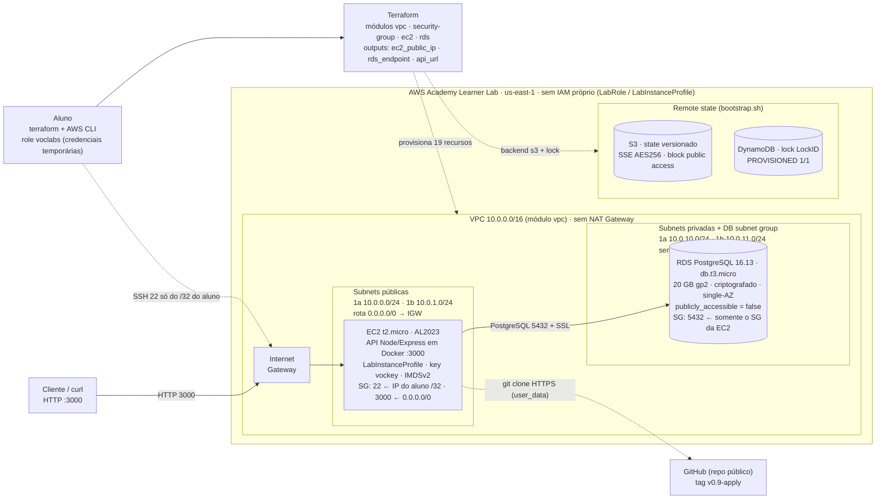

# Prova do Primeiro Bimestre — DevOps (API de Reservas · TechNova)

- **Aluno:** Gabriel Reis Cunha
- **RA:** 6325149
- **Disciplina:** DevOps — Análise e Desenvolvimento de Sistemas (2026.2)
- **Ferramenta de IA:** Claude Code

## Descrição

Ambiente completo e reproduzível da **API de Reservas** da TechNova: aplicação Node.js/Express
com CRUD de `reservas` persistido em PostgreSQL, containerizada com Docker, orquestrada
localmente com Docker Compose e provisionada na AWS (Learner Lab) com Terraform
modularizado (VPC, Security Groups, EC2 e RDS) e state remoto (S3 + DynamoDB).

## API

| Método | Rota | Descrição |
|--------|------|-----------|
| `POST` | `/reservas` | Cria uma reserva (valida campos obrigatórios) |
| `GET` | `/reservas` | Lista todas as reservas |
| `GET` | `/reservas/:id` | Busca por `id` (404 se não existir) |
| `PUT` | `/reservas/:id` | Atualiza uma reserva |
| `DELETE` | `/reservas/:id` | Remove uma reserva |
| `GET` | `/health` | Health check |

Campos: `id`, `cliente`, `data`, `status`. Valores aceitos em `status`:
`pendente` (padrão), `confirmada`, `cancelada`.

## Estrutura

```
app/          API de Reservas (src/, Dockerfile, .dockerignore, smoke.sh)
docker-compose.yml   API + PostgreSQL (ambiente local)
.env.example  Variáveis de ambiente (sem segredos)
infra/        Terraform: modules/{vpc,security-group,ec2,rds}, backend/ (bootstrap/teardown),
              main.tf, variables.tf, outputs.tf, providers.tf, terraform.tfvars.example
evidencias/   Evidências (docker, compose, terraform validate/plan; apply/destroy no dia da execução)
              e prompts-log.md (log de prompts do Claude Code)
specs/        SPEC, PLAN e TASKS (Spec-Driven Development)
relatorio.md  Relatório do processo com IA
```

## Como rodar localmente

Pré-requisito: Docker com Compose v2.

```bash
cp .env.example .env        # ajuste DB_PASSWORD (e API_PORT se a 3000 estiver ocupada)
docker compose up -d --build
docker compose ps           # api e db devem ficar (healthy)
curl http://localhost:3000/health
bash app/smoke.sh           # CRUD completo + casos de erro (BASE_URL=... para outra porta)
docker compose down         # mantém o volume pgdata; use -v para apagar os dados
```

## Infraestrutura AWS

Terraform modularizado no AWS Academy Learner Lab (`us-east-1`), usando `LabRole`/`LabInstanceProfile`
(nenhum recurso IAM é criado).

- **VPC** `10.0.0.0/16` com 2 subnets públicas e 2 privadas em 2 AZs, Internet Gateway, sem NAT Gateway.
- **EC2** `t2.micro` na subnet pública roda a API (o `user_data` clona a tag `repo_ref`, builda a imagem e sobe o container).
- **RDS** PostgreSQL 16 `db.t3.micro` nas subnets privadas: `publicly_accessible = false`, `storage_encrypted = true`.
- **Security Groups:** EC2 com 22 (só o seu IP/32) e 3000; RDS com 5432 apenas a partir do SG da EC2.
- **Remote state:** bucket S3 (versionado, criptografado) + tabela DynamoDB de lock, criados por `infra/backend/bootstrap.sh`.
- **Outputs:** `ec2_public_ip`, `rds_endpoint`, `api_url`.

### Arquitetura provisionada



Imagem do mesmo diagrama: [`evidencias/arquitetura.png`](evidencias/arquitetura.png).

Sequência (credenciais do Lab carregadas na sessão; senha e IP só em variáveis de ambiente, nunca em arquivo):

```bash
bash infra/backend/bootstrap.sh                 # cria S3 + DynamoDB e gera infra/backend.hcl
cd infra
export TF_VAR_ssh_cidr="$(curl -s ifconfig.me)/32"
export TF_VAR_db_password="<senha descartável, 8+ caracteres [A-Za-z0-9_.-]>"
terraform init -backend-config=backend.hcl
terraform validate && terraform plan
terraform apply
curl "$(terraform output -raw api_url)/health"
terraform destroy                               # logo após capturar as evidências
bash backend/teardown.sh                        # remove bucket e tabela do state
```
