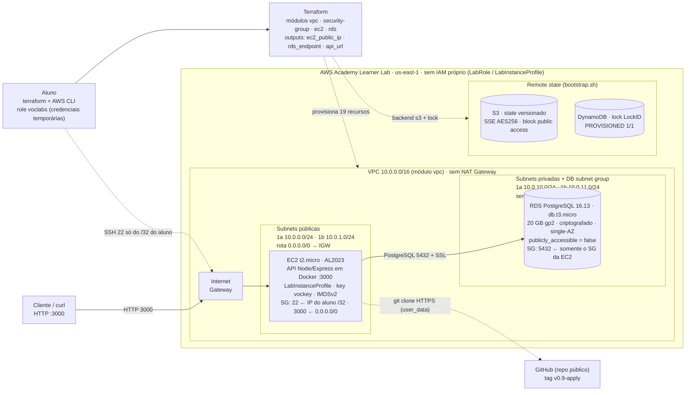

# Relatório do Processo — Prova do Primeiro Bimestre (DevOps)

**Aluno:** Gabriel Reis Cunha · **RA:** 6325149
**Ferramenta de IA utilizada:** Claude Code (Anthropic), com fluxo Spec-Driven Development (spec → plan → tasks → implementação).

## Questão 1 — A Jornada Completa (Aulas 01 a 07)

Lendo o material de aula, o TF, o TA de cada aula dá para ver que os problemas da Technova foram crescentes de maneira que a solução a ser implementada pelo aluno com o auxílio da IA sempre se complementa.

- A aula 01 foi sobre docker e git
- A aula 2 manteve o conteúdo da aula adicionando API + banco de dados PostgreSQL
- A aula 3 introduziu os conceitos sobre Segurança AWS com IAM e com os Lab para aplicar os conceitos já conhecidos em um ambiente cloud
- A aula 04 - introduziu os conceitos de VPC, subnet pública subnet privada, internet gateway, Route Table, Security Group e NACL no contexto de Firewall, Key Pairs e EC2 na AWS, não somente ensinando os conceitos, mas ensinando como utilizar eles na cloud, em específico na AWS.
- A aula 05 - depois de conduzir os conceitos sobre infraestrutura em ambiente cloud, a pergunta guia foi: Onde vamos guardar os dados do usuário. Então aprendemos sobre os conceitos de: RDS, DB Subnet Group, Multi-AZ, terraform para subir e mapear os recursos na AWS, backend S3, DynamoDB
- Aula 06: Depois de conseguir desenhar e implantar as necessidades da Technova de maneira completa e utilizando terraform para isso avançamos no conteúdo de terraform, aprendendo sobre Terraform Modules.
- Na aula 07, fugindo um pouco do ambiente de devops, foi uma aula focada em ensinar sobre os conceitos de decomposição, o dividir para conquistar da IA, metodologia SDD para Spec-Driven Development e como a IA pode ajudar a resolver problemas complexos de maneira que ajude o profissional a resolver grandes problemas em menos tempo, mas a necessidade que tem de supervisionar  o trabalho feito pela IA

### Onde cada aula apareceu na solução e a ordem seguida

A ordem seguiu a sugestão das Dicas do enunciado (Git e aplicação primeiro, depois container, depois Compose local e só então a AWS), precedida de uma etapa de especificação. A razão: o Terraform e a AWS eram o maior risco de tempo e de custo, então o que podia ser validado localmente (API, Docker, Compose) foi provado antes de gastar créditos do Learner Lab, e o backend de state foi criado antes do `backend "s3"`, como a prova recomenda.

1. **Especificar (24/09):** SPEC, PLAN e TASKS revisados por subagentes, antes de qualquer código (Aula 07).
2. **Git (24/09) e aplicação (25/09):** repositório, `.gitignore`, README e feature branch em 24/09; a API com CRUD em PostgreSQL em 25/09 (Aula 01).
3. **Container e Compose (25/09):** Dockerfile multi-stage e ambiente local com um comando, provando a persistência do volume (Aulas 01 e 02).
4. **Backend e módulos Terraform (25/09):** bootstrap do S3 + DynamoDB, módulos `vpc`, `security-group`, `rds` e `ec2`, composição na raiz, `validate` e `plan` (Aulas 03 a 06).
5. **Merge, tag e push (25/09):** merge `--no-ff` da feature branch e tag `v0.9-apply`, que a EC2 clona.
6. **Apply, evidências e destroy (26/09):** CRUD contra o RDS, evidências de segurança e state, `destroy` e `teardown` logo em seguida.

| Aula | Tema (README da aula) | Onde aparece na solução | Evidência |
|---|---|---|---|
| 01 | Git e Docker | Repositório, Conventional Commits, feature branch, `.gitignore`; `app/Dockerfile` multi-stage com `USER node` | `git-log-graph.txt`, `docker-build.txt` |
| 02 | Docker Compose e IA como copiloto | `docker-compose.yml` (volume, rede bridge, healthcheck, `depends_on`); uso do Claude Code | `compose-ps.txt`, `prompts-log.md` |
| 03 | Terraform e segurança AWS (IAM) | `providers.tf`, variáveis sensíveis, uso de `LabInstanceProfile` sem criar IAM | `terraform-plan.txt`, `seguranca-state.txt` |
| 04 | VPC, networking e EC2 | Módulos `vpc`, `security-group` e `ec2` (subnets públicas e privadas, IGW, SGs) | `terraform-apply.txt` |
| 05 | RDS e remote state | Módulo `rds` e backend S3 + DynamoDB (`infra/backend/`) | `seguranca-state.txt` |
| 06 | Terraform Modules | Quatro módulos compostos por outputs e inputs (`main.tf`) | `terraform-plan.txt` |
| 07 | Problemas complexos com IA (decomposição, Spec-Driven) | `evidencias/specs/` (spec, plan, tasks), revisores subagentes, log de prompts | `evidencias/specs/`, `prompts-log.md` |

## Questão 2 — O Processo com IA como Copiloto

Para essa prova eu não usei o Kiro, eu usei o Claude Code com a skill de Spec e gravei as regras da metodologia SDD no claude.md dela junto de outras boas práticas de programação.

No mérito de usar a IA como copiloto usar ela para criar a Spec validar, depois gerar o planejamento completo validar, depois gerar cada tasks e validar diminui bastante o grau de erro porque a IA define os passos que ela vai seguir. Você pode ver cada passo corrigir caso necessário, então você não precisa ter em mente cada passo que ela vai seguir após a execução, você no início pede para ela gerar o planejamento completo e depois corrige conforme a necessidade.

Como dá para ver no prompt logs que eu vou pedir para ela colocar abaixo. A quantidade massiva de decisões e revisões foi extremamente necessária para capturar a maioria dos erros descobertos, mas na fase de implementação ela só segue o planejamento que já foi especificado e validado, assim o trabalho que temos ou imprevistos diminui porque tanto você como a IA envolvida no processo sabe o que está sendo feito

### Fluxo usado, acertos e correções

**Fluxo.** O fluxo equivale ao requisitos → design → tarefas do Kiro: `spec.md` (objetivos, restrições, RF1 a RF21 e critérios de aceitação CA1 a CA17), `plan.md` (decisões técnicas e trade-offs) e `tasks.md` (41 tarefas, cada uma com uma verificação). Houve um checkpoint humano após cada etapa e revisão por subagentes independentes.

**O que a IA gerou bem** (com a evidência de cada ponto):

- A SPEC, o PLAN e as TASKS estruturados, com critérios verificáveis (`evidencias/specs/`).
- A API com validação (400 e 404), o Dockerfile multi-stage não-root e o Compose com healthcheck; o mesmo `smoke.sh` foi usado no ambiente local, no Compose e contra o RDS na nuvem (`smoke-local.txt`, `compose-ps.txt`, `curl-crud-rds.txt`).
- Os quatro módulos Terraform e a raiz: o `terraform validate` passou e o `plan` mostrou 19 recursos, sem IAM e sem NAT (`terraform-validate.txt`, `terraform-plan.txt`).
- Scripts idempotentes de `bootstrap.sh` e `teardown.sh` para o backend, e a documentação das evidências e do log de prompts.

**O que precisou de correção** (e quem detectou):

| # | Problema | Detectado por | Correção |
|---|---|---|---|
| 1 | Log de prompts feito como resumo, não literal | Aluno (P10) | Log reescrito com todos os prompts literais |
| 2 | RDS PostgreSQL 15 ou superior exige SSL; API sem retry de conexão; DynamoDB on-demand fora do free-tier; Node 20 em fim de vida | Revisor do PLAN (B2) | PLAN corrigido antes de implementar |
| 3 | Senha do RDS podia vazar pelo `user_data` nas evidências | Revisor do PLAN (B2) | Verificação por `grep` e máscara antes de commitar |
| 4 | Título exato do PR, tag `v0.9-apply` e variáveis do plan | Revisor das TASKS (B3) | TASKS ajustadas |
| 5 | `relatorio.md` inexistente, com a T05 marcada como feita | Revisor do repo (B4) | Esqueleto criado e task anotada |
| 6 | Datas erradas em duas evidências (26/09 em vez de 25/09) | Revisor do repo (B4) | Datas corrigidas |
| 7 | `apply -auto-approve` sobre um plano novo, não revisado | Bloqueio do sistema e aluno (P22) | Interrompido antes de criar recursos; passou a valer `plan -out` revisado seguido de `apply` do plano salvo |
| 8 | `tfplan` (com a senha em binário) fora do `.gitignore`; IP do aluno e account-id nas evidências | A própria IA, ao revisar | Corrigidos antes de qualquer commit |
| 9 | Persistência provada só com `restart`; verificação pós-destroy sem saída; item de lock não capturado | Auditor (B5) | Provas refeitas com `down` e `up`, saída literal e captura do lock real |

**IA comparada com fazer manualmente.**

- Tempo registrado: SPEC, PLAN, TASKS e três revisões em 24/09. Os commits dos dias 2 a 5 (API, Docker, Compose, backend, módulos, validate e plan) ocorreram entre 21:54 e 22:37 de 25/09. O apply, o CRUD e o destroy levaram cerca de 25 minutos em 26/09 (`git log`, `terraform-apply.txt`).
- Onde economizou: código repetitivo (módulos, scripts, Compose), evidências e log, e revisões em paralelo por subagentes.
- Onde atrapalhou ou custou tempo: os erros da tabela acima, a revisão necessária de cada saída e o retrabalho de evidências.
- Não houve medição de uma execução manual de referência; qualquer comparação de tempo é estimativa.
- Definitivamente desenvolver manualmente seria muito mais demorado do que foi realmente, a IA poder escrever o código e depois poder revisar de acordo com o planejamento revisado por você é muito melhor para o ciclo de desenvolvimento. Você apenas pode analisar o código escrito e pedir para ele mudar conforme a necessidade.

### Prompts que sustentam o relato (trechos literais de `evidencias/prompts-log.md`)

*Bloco inserido pela IA a pedido do aluno; os prompts estão exatamente como foram enviados, com os erros de digitação originais.*

Números do log: o aluno enviou 27 prompts ao modelo. Na fase de levantamento, Spec, Plan e Tasks (P02 a P10) foram 9 prompts, acompanhados de 3 prompts longos que a IA enviou a subagentes revisores (B1 a B3, com 207, 211 e 162 palavras). Na implementação dos dias 2 a 4 (P12 a P16) os prompts do aluno tiveram em média 4 palavras, porque a IA só seguia as tasks já aprovadas.

| Fase | Prompt do aluno (literal) | Efeito |
|---|---|---|
| Levantamento | **P03** "Antes eu quero que voce carregue o contexto das regras e das dicas isso [e muito importante. Vamos executar passo a passo cada uma para garantir a entrega no tempo adequado, temos uma semana" | Regras e dicas da prova guardadas antes de qualquer código; cronograma de 7 dias |
| Spec | **P05** "Dispare um subagent com somente as regras e CAs da prova e dispare para ele encontrar erro na sua SPEC. 2. Pode usar" | Revisor (B1) apontou lacunas; a SPEC foi corrigida antes de seguir |
| Plan | **P06** "aprovado, siga para o Plan, depois voce deve disparar um novo subagent com o contexto do .md da prova" | Revisor (B2) pegou SSL obrigatório no RDS, retry de conexão, DynamoDB on-demand fora do free-tier, Node 20 em EOL |
| Tasks | **P07** "gere o tasks.md" e **P08** "Dispare um revisor validando se as regras citadas no arquivo da prova e os requisitos de cada parte estao sendo seguidas" | 41 tarefas verificáveis; revisor (B3) ajustou título do PR, tag `v0.9-apply`, variáveis do plan |
| Decisão | **P09** "Aprovo; Sobre a Questao 2 o professor autorizou qualquer LLM, entao pode falar que e Claude Code. Sobre o entrega.md e para seguir exatamente o modelo fornecido pela prova para a entrega do professor." | Aprovação humana do Specify, Plan e Tasks (checkpoint do fluxo) |
| Processo | **P10** "Voce esta armazenando os prompts? Devem ser todos sem exceção" | Corrigiu uma falha da IA: o log estava resumido e passou a ser literal |
| Implementação | **P12** "siga para o dia 2", **P14** "siga para o dia 3", **P16** "siga para o dia 4" | API, Docker e Compose executados só seguindo as tasks aprovadas |
| Validação | **P22** "opção 2, interrompe e limpa" e **P24** "pode aplicar o plano salvo" | Ao interromper o `apply` feito sem revisão e só aplicar o plano salvo e revisado |

Leitura das fases: a decisão do que construir, com quais restrições e como validar aconteceu no início (P02 a P10), com revisão cruzada por subagentes. A implementação depois foi guiada por prompts curtos. As revisões e auditorias voltaram nos dias finais (por exemplo P19 e P25), porque revisar continua sendo necessário depois de executar.

## Questão 3 — Infraestrutura, Segurança e o Learner Lab

O claude incluiu um desenho feito no mermaid sobre a arquitetura do projeto:

- Por que o RDS fica na subnet privada e a EC2 na pública? O RDS é um serviço de banco de dados gerenciado pela AWS, ou seja, todos os dados sensíveis de clientes estão lá e sendo assim eu não posso deixar uma porta aberta pública para qualquer um acessar. Dessa maneira limitar em uma subnet privada é uma maneira que eu tenho para proteger o acesso de quem pode entrar e restringir para que ele não seja facilmente detectável por pessoas com intenções maliciosas

- **Por que a EC2 fica na subnet pública:** a API precisa receber requisições da internet (porta 3000, pelo Internet Gateway) e o aluno precisa administrar a instância (SSH na 22, liberado só para o IP do aluno em /32). O RDS não recebe tráfego da internet: só a EC2 alcança a porta 5432, porque o SG do RDS aceita apenas o SG da EC2 como origem (`referenced_security_group_id`), sem `0.0.0.0/0`. Prova: a tentativa de conexão TCP externa ao RDS não abriu (`seguranca-state.txt`).

- Como funcionou o uso do LabRole/LabInstanceProfile em vez de criar IAM próprio? Especificamente no learner lab o permitido é usar LabRole / LabInstanceProfile até mesmo para que não se possa criar diferentes usuários com diferentes políticas de permissões de acesso além do permitido. É uma segurança dentro do AWS Learner Lab Academy utilizado para a execução das aulas

- Que ajustes o AWS Academy Learner Lab exigiu em relação ao que foi ensinado (credenciais temporárias, região, restrições de IAM)? A própria AWS Academy Learner Lab limita a criação de roles, deixando somente a role da própria conta que seja utilizada, outros serviços também são limitados

### Complementos da Questão 3

- **Como o LabRole e o LabInstanceProfile foram usados na prática:** a EC2 recebe `iam_instance_profile = "LabInstanceProfile"` apenas por nome, e o provider usa as credenciais da role do Lab (`voclabs`). Nenhum recurso IAM foi criado: `terraform state list` não tem nenhum `aws_iam`.
- **Credenciais temporárias:** o Lab entrega Access Key, Secret e Session Token (carregados por `aws-creds.sh`) que expiram. No início do dia 5 a sessão já estava expirada (`InvalidClientTokenId`) e precisou ser renovada.
- **Região:** tudo em `us-east-1`; as AZs foram escolhidas depois de conferir com a AWS CLI que `t2.micro` e `db.t3.micro` estão disponíveis (`aws-precheck.txt`).
- **Restrições do Lab que mudaram o que foi ensinado:** o SCP do Lab bloqueia `GetBucketObjectLockConfiguration`, por isso o bucket do state foi criado pela AWS CLI (`bootstrap.sh`) e não pelo recurso `aws_s3_bucket` do Terraform; não se cria IAM próprio; o `dynamodb_table` do backend aparece como obsoleto no Terraform 1.15, mas foi mantido porque o enunciado exige DynamoDB para o lock.
- **Segurança adicional aplicada:** RDS com `storage_encrypted = true` e `publicly_accessible = false`; bucket do state com versionamento, SSE e bloqueio de acesso público; IMDSv2 na EC2.
- **Limitações a reconhecer:** a senha do RDS passa pelo `user_data` e pelo `docker run` (aceitável só com senha descartável no Lab) e a API usa `rejectUnauthorized: false` no SSL do RDS.

### Diagrama da arquitetura provisionada

*Bloco inserido pela IA a pedido do aluno, a partir do `terraform plan`/`apply` real (19 recursos). Versão em imagem, renderizada com o mermaid-cli: `evidencias/arquitetura.png`.*

## Questão 4 — Validação e Responsabilidade

Antes de aplicar o terraform apply devemos conferir se aquilo que foi planejado bate corretamente com o enunciado e com as necessidades do exercício então os seguintes pontos foram validados:

- Pontos verificados antes do apply: sem IAM; sem NAT; VPC 2 AZs pública/privada; SG EC2 (22 e 3000) e RDS (5432 só do SG da EC2, sem `0.0.0.0/0`); EC2 t2.micro com `LabInstanceProfile`; RDS db.t3.micro privado, criptografado, subnet group privado; tags; sem senha/account-id nas evidências; plano salvo (`-out`) e revisado antes de aplicar.

- Como validou: `terraform validate` e `plan`, revisão do plano, CRUD no RDS via `api_url`, `describe-db-instances`, `describe-security-groups`, state no S3 (versionado/SSE), lock no DynamoDB, e verificação pós-destroy por CLI.

- Caso não houvesse revisão da IA ela teria gerado esses erros que foram coletados e evitados, mas que poderiam ter acontecido e seria descoberto apenas depois:

1. Senha vazando nas evidências
2. `0.0.0.0/0` na 5432
3. DynamoDB fora do free-tier (caso fosse uma aplicação real fora do ambiente de $50 créditos do Learner Lab executar teria prosseguido em custos reais e indesejados)
4. `tfplan` com senha sem estar no `.gitignore`.

No geral são erros pequenos, detalhes minuciosos que pedem a revisão do código escrito pela IA para serem pegos e resolvidos. Mesmo com detalhe e planejamento alguns erros menores podem acontecer e que precisam da revisão humana para perceber.

- Como a evolução Git → Docker → Terraform → Modules preparou você para usar IA com responsabilidade? Essa evolução do conhecimento sobre cada tecnologia te auxilia a não ser alguém que apenas concorda com a IA, mas alguém que de fato autentica que o que ela está escrevendo é verdadeiro, faz sentido de acordo com o contexto e que pode corrigir de acordo com cada caso
