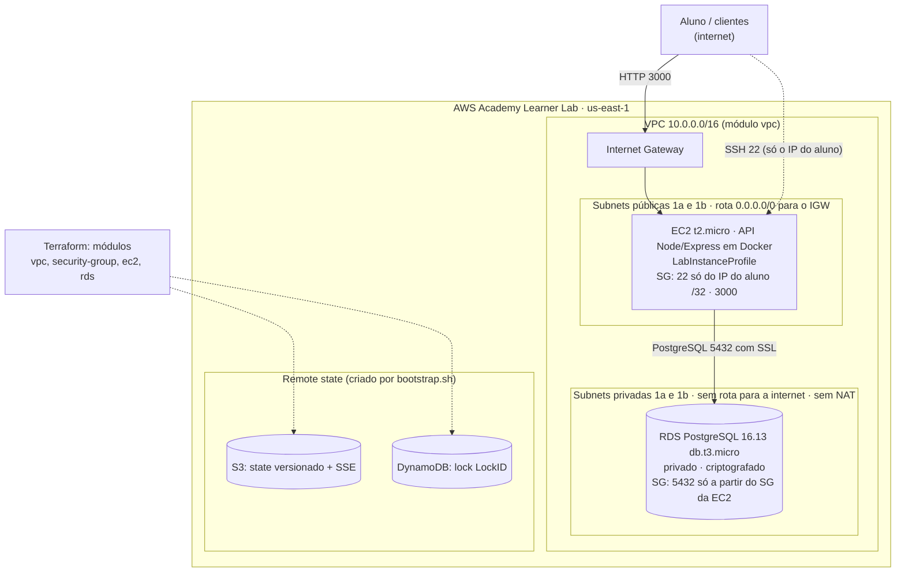

# Relatório do Processo — Prova do Primeiro Bimestre (DevOps)

**Aluno:** Gabriel Reis Cunha · **RA:** 6325149
**Ferramenta de IA utilizada:** Claude Code (Anthropic), com fluxo Spec-Driven Development (spec → plan → tasks → implementação).

## Questão 1 — A Jornada Completa (Aulas 01 a 07)

Lendo o material de aula, o TF, o TA de cada aula dá para ver que os problemas da Technova foram crescentes de maneira que a solução a ser implementada pelo alauno com o auxilio da IA sempre se complementa. 

- A aula 01 foi sobre docker e git
- A aula 2 foi manteve o conteúdo da aula adicionando API + banco de dados PostgreSQL
- A aula 3  instroduzi os conceitos sobre AWS com os Lab para aplicar os conceitos já conhecidos em um ambiente cloud
- A aula 04 - instroduziu os conceitos de VPC, subnet pública subnet privada, internet gateway, Route Table, Seurity Grop e NACL no contexto de Firewal, Key Pairs e EC2 na AWS, não somente ensinando os conceitos, mas ensinando como utilizar eles na cloud, em específico na AWS.
- A aula 05 - depois de conduzir os conceitos sobre infraestrutura em ambiente cloud, a pergunta guia foi: Onde vamos guardar os dados do usuário. Então aprendemos sobre os conceitos de: RDS, DB Subnet Group, Multi-AZ, terraform para subir e mapear os recursos nma AWS, backenf S3, DynamoDB
- Aula 06: Depois de conseguir desenhar e implantar as necessidades da Technova de maneira completa e utilizando terraform para isso avançamos no conteúdo de terraform, aprendendo sobre Terraform Modules.
- Na aula 07, fugindo um pouco do ambiente de devops, foi uma aula focada em ensinar sobre os conceitos de decomposição, o dividir para conquistar da IA, metodologia SDD para Spec-Driven Development e como a IA pode ajudar a resolver problemas complexos de maneira que ajude o profissional a resolver grandes problemas em menos tempo, mas a necessidade que tem de superviosnar  o trabalho feito pela IA

## Questão 2 — O Processo com IA como Copiloto

Para essa prova eu não usei o Kiro, eu usei o Claude Code com a skill oficial de Spec disponibilizada pelo Github e gravei as regras da metodologia SDD nela. No geral para criar a Spec validar, depoiis gerar o planejamento completo validar, depis gerar cada tasks e validar diminui bastante o grau de erro porque a IA define os passos que ela vai seguir. Você pode ver cada passo corrigir caso necessário, então você não precisa ter em mente cada passo que ela vai seguir após a execução, você no início pede para ela gerar o planejamento completoi e depois corrige conforme a necessidade. Como dá para ver no prompt logs que eu vou pedir para ela colocar abaixo. A quantidade massiva de prompts foi na fase de planejamento do que ela iria seguir, mas na fase de implementaçãoa ela só segue o planejamento que já foi especificado e validado, assim o trabalho que temos ou imprevistos diminui porque tanto você como a IA envolvida no processo sabe o que está sendo feito

### Prompts que sustentam o relato (trechos literais de `evidencias/prompts-log.md`)

*Bloco inserido pela IA a pedido do aluno; os prompts estão exatamente como foram enviados, com os erros de digitação originais.*

Números do log: o aluno enviou 27 prompts ao modelo. Na fase de levantamento, Spec, Plan e Tasks (P02 a P10) foram 9 prompts, acompanhados de 3 prompts longos que a IA enviou a subagentes revisores (B1 a B3, com 207, 211 e 162 palavras). Na implementação dos dias 2 a 4 (P12 a P16) os prompts do aluno tiveram em média 4 palavras, porque a IA só seguia as tasks já aprovadas.

| Fase | Prompt do aluno (literal) | Efeito |
|---|---|---|
| Levantamento | **P03** "Antes eu quero que voce carregue o contexto das regras e das dicas isso [e muito importante. Vamos executar passo a passo cada uma para garantir a entrega no tempo adequado, temos uma semana" | Regras e dicas da prova guardadas antes de qualquer código; cronograma de 7 dias |
| Spec | **P05** "Dispare um subagent com somente as regras e CAs da prova e dispare para ele encontrar erro na sua SPEC. 2. Pode usar" | Revisor (B1) apontou lacunas; a SPEC foi corrigida antes de seguir |
| Plan | **P06** "aprovado, siga para o Plan, depois voce deve disparar um novo subagent com o contexto do .md da prova" | Revisor (B2) pegou SSL obrigatório no RDS, retry de conexão, DynamoDB on-demand fora do free-tier, Node 20 em EOL |
| Tasks | **P07** "gere o tasks.md" e **P08** "Dispare um revisor validando se as regras citadas no arquivo da prova e os requisitos de cada parte estao sendo seguidas" | 41 tarefas verificáveis; revisor (B3) ajustou título do PR, tag `v0.9-apply`, variáveis do plan |
| Decisão | **P09** "Aprovo; Sobre a Questao 2 o professor autorizou qualquer LLM, entao pode falar que e Claude Code. Sobre o entrega.md e para seguir exatamente o modelo fornecido pela prova para a entrega do professor." | Aprovação humana do Specify, Plan e Tasks (checkpoint do fluxo) |
| Processo | **P10** "Voce esta armazenando os prompts? Devem ser todos sem exceção" | Corrigiu uma falha da IA: o log estava resumido e passou a ser literal |
| Implementação | **P12** "siga para o dia 2", **P14** "siga para o dia 3", **P16** "siga para o dia 4" | API, Docker e Compose executados só seguindo as tasks aprovadas |
| Validação | **P22** "opção 2, interrompe e limpa" e **P24** "pode aplicar o plano salvo" | Ao interromper o `apply` feito sem revisão e só aplicar o plano salvo e revisado |

Leitura das fases: a decisão do que construir, com quais restrições e como validar aconteceu no início (P02 a P10), com revisão cruzada por subagentes. A implementação depois foi guiada por prompts curtos. As revisões e auditorias voltaram nos dias finais (por exemplo P19 e P25), porque revisar continua sendo necessário depois de executar.

## Questão 3 — Infraestrutura, Segurança e o Learner Lab

O claude vai incluir um diagrama mermaid abaixo sobre a arquitetura completa criada nesse exercício, mas respondendo as perguntas objetivamente:

- Por que o RDS fica na subnet privada e a EC2 na pública? O RDS é um serviço de banco de dados gerenciado pela AWS, ou seja, todos os dados sensíveis de clientes estão lá e sendo assim eu não possa deixar uma porta aberta publica para qualquer um acessar. Dessa maneira limitar em uma subnet privada é uma maneira quue eu tenho para proteger o acesso de quem pode entrar e restringir para que ele não seja facilmente detectavel por pessoas com itenções maliciosas

- Como funcionou o uso do LabRole/LabInstanceProfile em vez de criar IAM próprio? Especificamente no learner lab o permitido é usar LabRole / LabInstanceProfile até mesmo para que não se possa criar diferentes uusuários com diferentes políticas de permissões de acesso além do permitido. É uma segurança dentro do AWS Leaner Lab Academy utilizado para a execução das aulas

- Que ajustes o AWS Academy Learner Lab exigiu em relação ao que foi ensinado (credenciais temporárias, região, restrições de IAM)? A própria AWS Academy Leaner Lab limita a criação de roles, deixando somente a role da própria conta que seja utililzada, outros serviços também são limitados

### Diagrama da arquitetura provisionada

*Bloco inserido pela IA a pedido do aluno, a partir do `terraform plan`/`apply` real (19 recursos).*

## Questão 4 — Validação e Responsabilidade

Antes de aplicar o terraform apply devemos conferir se aquilo que foi planejado bate corretamente com o enunciado e com as necessidades do exercício então os seguintes pontos foram validados:

- Checklist aplicado antes do apply (T27): sem IAM; sem NAT; VPC 2 AZs pública/privada; SG EC2 (22 e 3000) e RDS (5432 só do SG da EC2, sem `0.0.0.0/0`); EC2 t2.micro com `LabInstanceProfile`; RDS db.t3.micro privado, criptografado, subnet group privado; tags; sem senha/account-id nas evidências; plano salvo (`-out`) e revisado antes de aplicar.

- Como validou: `terraform validate` e `plan`, revisão do plano, CRUD no RDS via `api_url`, `describe-db-instances`, `describe-security-groups`, state no S3 (versionado/SSE), lock no DynamoDB, e verificação pós-destroy por CLI.

- Caso não houvesse revisão doa IA gerou esses erros reais coletados e enumerados poderiam ter acontecido e seria sdescoberto apenas depois: 

1. Senha vazando nas evidências
2. `0.0.0.0/0` na 5432
3. DynamoDB fora do free-tier (caso fosse uma aplicação real fora do ambiente de $50 créditos do LeanerLasb executar teria prosseguido em custos reais e indesejados)
4. `tfplan` com senha sem estar no `.gitignore`.

No geral são erros pequenos, detalhes minuciosos que pedem a revisão do código escrito pela IA para serem pegos e resolvidos. Mesmo com detalhe e planejamento alguns erros menores podem acontecer e que precisão da revisão humana para perceber.